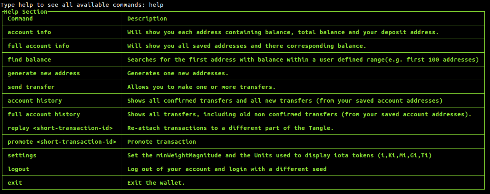

<h1 align="center">CL-Wallet</h1>

<div align="center">
  <strong>A python based command line Wallet for IOTA.</strong>
</div>
<div align="center">
  Please note that this is is still in Alpha stages and as such not all functionality is integrated yet.
</div>

<br />

## Table of Contents
- [Features](#features)
- [Usage](#usage)
- [Installation](#installation)

## Features
- __Address management:__ Addresses don't need to be attached to the tangle.
- __Snapshot management:__ Immune to snapshots as all necessary data is saved in a local file.
- __Multiple transfers:__ Can send multiple transfers in one bundle.
- __Reattachment:__ Allows you to easily reattach transactions.
- __Promotion:__ Allows you to easily promote transactions.
- __Balance detection:__ Allows to easily search for missing balance.

## Usage

For using CL-Wallet, you will need Python 2.7 or 3.

On windows you can just use the "Start CL Wallet.bat".
For any other OS you need to open "wallet.py" via command line.

#### Important: If you start via command line, make sure to use a console that has a width of 140 columns.



- __Account Info:__ Displays latest addresses information with balance.
- __Full account info:__ Displays all addresses information with balance.
- __Find balance:__ Generates addresses and find balances.
- __Generate new address:__ Generates new addresses.
- __Send transfer:__ Allows to make multiple transfers.
- __Account history:__ Displays recent & confirmed transaction history.
- __Full Account history:__ Displays all transaction history.
- __Replay:__ Reattaches bundle to the tangle.
- __Promote__ Promotes transaction.
- __Settings__ View or update account settings (Min weight magnitude, IRI node, IOTA units).
- __Logout__ Logs out active account and allows you to log in from a different seed.
- __Exit__ Closes wallet.

## Installation

Install dependencies
```
pip install -r requirements.txt
```

Run the wallet

```
python wallet.py
```
